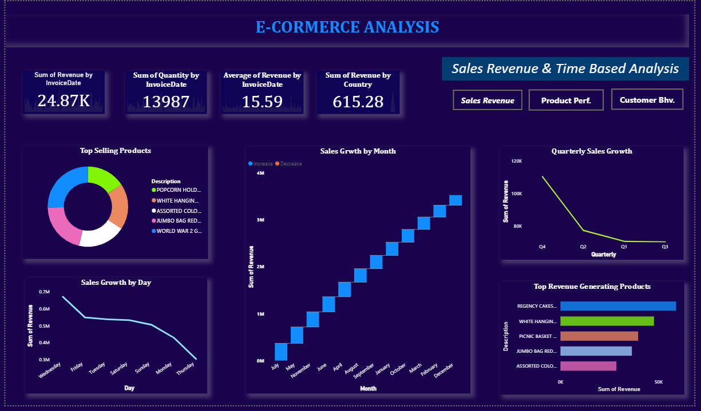

# E-Commerce Analysis

This project explores an E-Commerce transactional dataset to uncover insights into customer behavior, product performance, and revenue trends. Using Power BI, SQL, Python, and Excel, the analysis provides a data-driven view of sales operations, helping businesses make smarter decisions.. 📈🔍

## Dataset Description 🏠

The dataset contains transaction-level records with the following fields:

- StockCode – Unique product code

- Description – Product name/description

- Quantity – Number of items purchased per transaction

- InvoiceDate – Date of purchase

- UnitPrice – Price per unit of product

- CustomerID – Unique customer identifier

- Year, Month, Day, Quarter – Derived date attributes for time-series analysis

- Revenue – Total sales value (Quantity × UnitPrice)

- Country – Customer’s location

# Key Analysis Goals📋

- Identify top-selling products by quantity and revenue

- Track total revenue and total products sold over time

- Measure customer purchasing patterns (e.g., frequency, invoice count)

- Compare year-over-year and quarterly trends

- Build KPI dashboards (e.g., Total Revenue, Products Sold, Distinct Customers)

- Analyze regional performance by country

## Insights & KPIs🔎
- Total Revenue Generated across all transactions

- Total Products Sold (sum of quantity)

- Top N Products (by sales & revenue contribution)

- Customer Segmentation (high-value vs low-value customers)

- Time Series Trends (monthly, quarterly, yearly)

- Geographical Analysis of sales by country

## Tools & Skills Used 🎨

- Power BI – Interactive dashboards, KPIs, and trend visualizations

- SQL – Data cleaning, aggregation, and querying

- Python (Pandas, Matplotlib) – Exploratory Data Analysis (EDA) and visualization

- Excel – Quick summaries, pivot tables, and checks

## 🔷 Sales Dashboard

### 💡 Key Highlights:
- **Total Impressions**: **2.48M** | **Total Likes**: **24.5K** | **Total Engagements**: **112.42K**
- **Photo content dominates** with **80K likes**, far outpacing video, text, and link types.
- **Damilare Oyelami** and **Aramide Salami** were the top-performing marketers with **35K** and **34K likes** respectively.
- Engagement surged in **2020 (25K likes)** and maintained a steady high through **2023 (24K likes)**.
- **November** and **February** were the peak months for user interaction, showing consistent seasonal interest.

## 🔷 Customer Dashboard

### 💡 Key Highlights:
- **Total Engagement**: 0.18K | **Post-Clicks**: 0.13K
- **Impressions**: 2.95K with no measurable shares
- **Aramide Salami** is the leading contributor with over **2.9K post-clicks**
- Engagement has dropped consistently since **2020**
- Majority of interactions come from **video content**

  ## 🔷 Twitter Dashboard

### 💡 Key Highlights:
- **13.67K Total Likes**, **1.55M Impressions**, and **58.19K Engagements**
- Photo content dominates with **68K likes**, followed by videos and links
- Highest engagement seen in **2019–2020** (25K–26K likes), slight recovery in 2022–2023
- **Sophia Amuka** tops user engagement with a massive **66K likes**

## 🔷 Instagram Dashboard

### 💡 Key Highlights:
- **3.25K Total Engagements**, **2.36K Likes**, and **0.11M Impressions**
- Engagement is dominated by **video content** (over 150K views)
- **Blessing Ubah** led marketers with **7.3K likes**, followed by **Aramide Salami**
- Engagement peaked in **2020**, declined afterward

**Insights and Recommendations ✨💡**

Content Strategy: Focus on photo-based content, as it consistently drives higher engagement. 📷
Marketer Performance: Leverage top performers (e.g., Sophia, Blessing) for key campaigns to maximize impact. 👥
Temporal Trends: Analyze months with high engagement (e.g., January) for optimized posting schedules. Investigate declines (e.g., 2020–2021 dips) to adjust strategies. ⏳
Growth Potential: The rise in impressions suggests expanding reach; consider scaling content production to maintain momentum. 🌱

## Contact details ☎📞

- Email address: ikanostic@gmail.com
- WhatsApp: +2348148283571
- Twitter: @ikanostic
- Telegram: @ikanostic
  
## Technologies Used 💻
Visualization: Built using a data visualization library (like Python(Matplotlib, Seaborn and pandas) /as well as Power BI tool)

